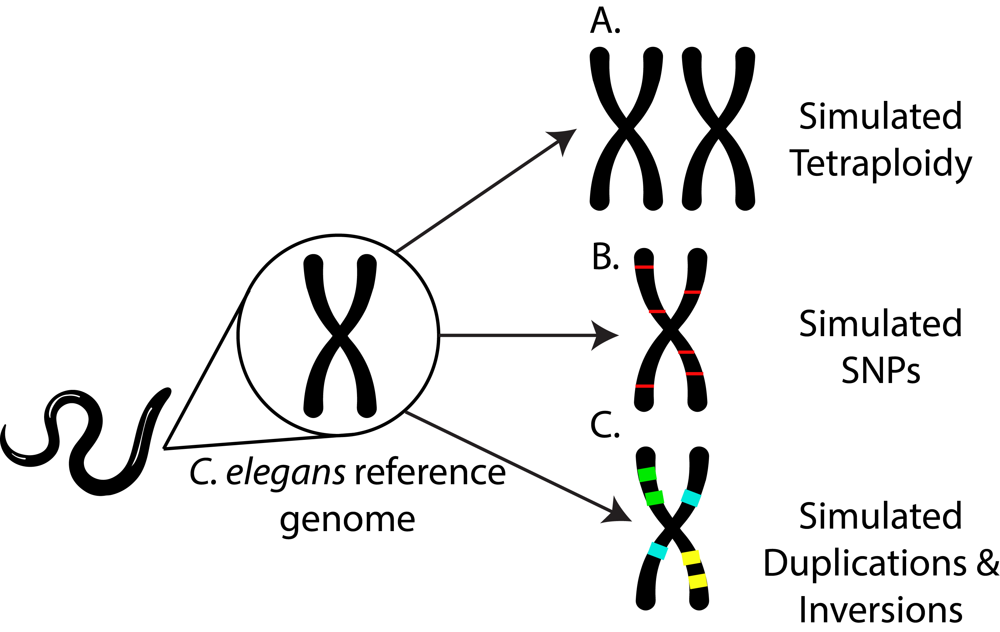
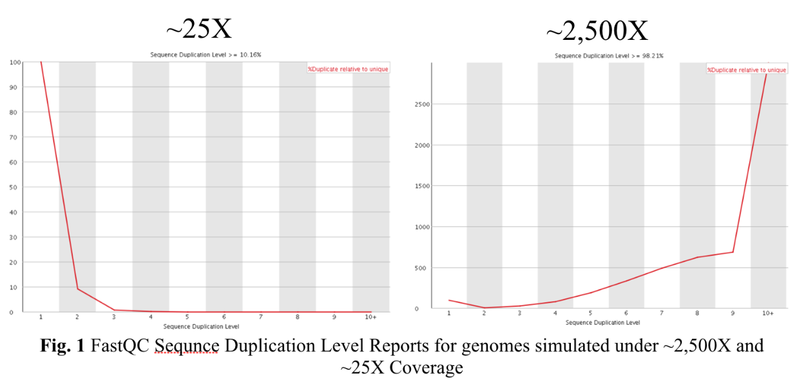
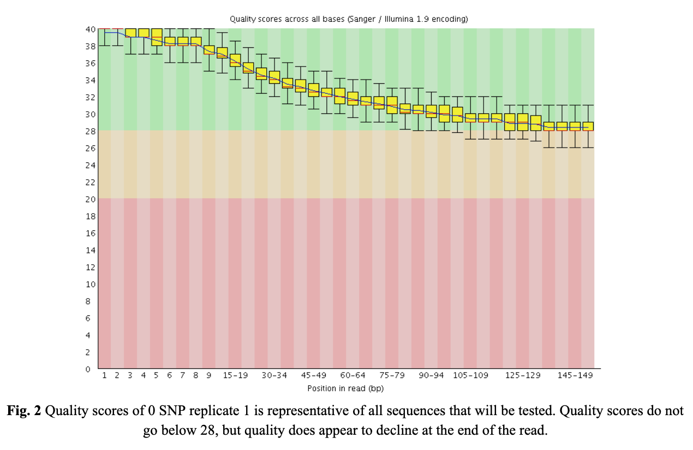

# Step 1

## Background
Quality control is an important first step in any bioinformatic pipeline to identify potential problems with high-throughput sequence output. Failure to appropriately quality control your data can confound further downstream analyses, or worse yet, lead researchers to erroneous conclusions. Here we report the results of a FastQC analysis, a popular software that performs basic quality control checks on high-throughput sequence data. FastQC was run on both the Alabama Supercomputer and Galaxy web platform. 

#### Tetraploidy (Fig 1A)
The variable we are interested in testing for our tetraploid genomes is coverage. One genome was simulated under a coverage similar to the rest of the samples (~24X after rerunning, see Simulations). Three additional genomes were simulated under 12X, 6X, and 3X, respectively. 

#### SNPs (Fig 1B)
The variable tested for SNP variation in C. elegans simulated genome. Three genomes were simulated with 0 SNPs, three with 1 SNP per 50,000 bases, three with 1 SNP per 10,000 bases, and three with 1 SNP per 100 bases.  

#### Duplications and Inversions (Fig 1C)


### Figure 1. Experimental Schema

## Simulations
Before applying quality control,  the whole genome sequencing is simulated by 10X Genomics Linked Read technology. In this project, the simulated read were estimated for compatibility using package “longRanger” and “supernova”. The default parameters are set as the table below containing reference genome and variants, illumina reads characteristics and linkage read parameters. Each member of the group selects a variant to resimulate the sequencing.(Luo n.d.)   
```./simulateLinkedReads.pl -r/-g <reference/haplotypes> -p <output prefix>```   
1,800,000,000 sequences were reported for each of our simulated genomes, with a sequence length of 135-151. Using the reference genome size estimate of 100,286,401 provides an estimate of 2,423X-2,710X coverage. The software used for the simulation of experimental genomes was developed for a human genome, a genome that is about 30X the size of our experimental genome. After modulating the simulated reads from 600 million to 6 million, we were able to modify our coverage from 2500X to about 25X. Once genomes were resimulated with 1/100th the number of raw read pairs, estimated coverage was 24X-27X. 

## FastQC
FastQC is an application which reads raw sequence data from high throughput sequencers and runs a set of quality checks to produce a report which allows you to quickly assess the overall quality of your run, and to spot any potential problems or biases.   
```./fastqc <simulated fastqc reads>```   
No sequences were filtered by FastQC. Our simulated genomes passed seven quality checks, raised warnings for three, and failed one. Warnings were raised for the per base sequence content test, sequence length distribution test, and Kmer content test. The sequence duplication level test was failed initially, but passed once genomes were simulated under more realistic coverages (Fig.2). When the same checks were performed on the Galaxy webserver results were the same, however the test scores were not. Notably, the per base sequence content test raised a warning when FastQC was run through the command line but not on Galaxy, even though the results were the same (~18% GC, ~32% AT).
Our sequences maintained a quality score that was above 28 (Fig 2.), therefore we decided against trimming of our simulated reads. FastQC and Galaxy analysis showed 12 different variations of our genomes (with 3 replicate of each genome), but further steps with this project might require variation on the amount of reads per experimental genome simulation. This would provide a more realistic input for downstream applications.  



## Reference
Luo, R. (n.d.). GitHub - aquaskyline/LRSIM: 10x Genomics Reads Simulator. Retrieved September 18, 2019, from https://github.com/aquaskyline/LRSIM


