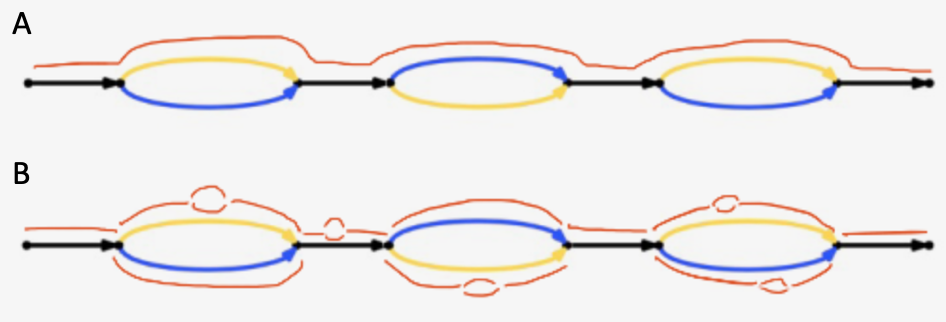
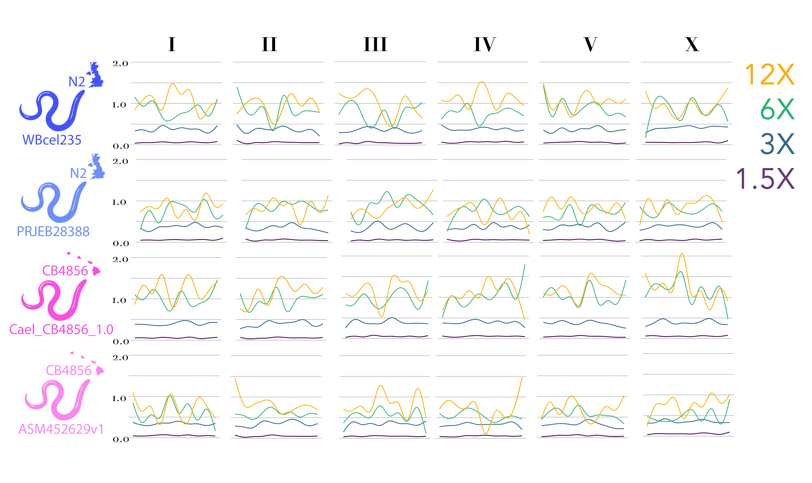

# Ploidy Boi's Step 5

Kyle David, Sarah Martin, and Yan Yu

## Tetraploids
### Assembly 
De Novo Tetraploid genomes were assembled using two different methods provided by the 10X Genomics Supernova pipeline. The first method, pseudohap, produces a single record per scaffold, flattening bubbles and joining gaps (Fig 1A). With the pseudohap method paternal and maternal alleles are selected randomly. The second method, raw, is the most detailed method under which every edge in the assembly is represented by a record including all bubbles, reverse complements, alleles, and gaps (Fig 1B).     

#### Figure 1.
Unsurprisingly, in terms of de novo assembly the pseudohap option produced fewer, larger, sequence records than the raw option across all coverage levels (Table 1). Also unsurprisingly, assemblies improved across both strategies as coverage increased. The highest level of coverage had roughly twice the N50 as the second highest coverage, which in turn had about twice the N50 of the third highest. However it is worth noting that all strategies and coverage levels produced extremely poor de novo genomes with thousands of scaffolds. As a result we would not recommend this approach for a system without a good reference to be aligned to after assembly.
#### pseudohap assemblies
 Coverage| 3X  | 6X  | 12X  | 24X 
--- | --- | --- | --- | ---
number of records | 2037 | 18590 | 2968 | 2126  
avg. record length | 1393.17 | 3217| 34604.73 | 48507.72 
N50 | 1326 | 4298 | 577793 | 1385223
### raw assemblies
 Coverage| 3X  | 6X  | 12X  | 24X 
--- | --- | --- | --- | ---
number of records | 53924 | 201074 | 145098 | 148888  
avg. record length | 413.65 | 756.16| 2515.27 | 2671.34
N50 | 530 | 1802 | 22489 | 39973

### Alignment
Reads produced from the raw method were also mapped back to the reference they were originally simulated from (Fig. 2)     
   
#### Figure 2. coverage levels across all chromosomes in the phased tetraploid reference genome, colored by initial coverage levels they were simulated at.       
Encouragingly, coverage was present across all chromosomes. There was initially a concern that reads would only align to one genome copy or genotype but this does not appear to be the case. However, while reads are spread evenly across the four sets of chromosomes the overall coverage is quite bad (1-2X). While coverage for a phased genome likely does not require the same standards as diploid alignments (no need to distinguish between alleles), this quality of alignment is probably not up to scientific standards. The low coverage may be the result of issues with the Supernova de novo assembly. Supernova estimates the genome size and uses this value to calculate coverage, which must lie between an acceptable range of 38x-56x. However, Supernova the genome size estimates for our simulated tetraploid genomes were consistently low (about half, indicating that the method can not distinguish polyploid genomes). Consequently coverage was overestimated for the diploid genome, translating to less overall representation across the "real" tetraploid genome. We also notice that we reach a point of diminishing returns on our simulated coverage levels. 24X and 12X alignments were largely similar compared to 6X and 3X (Fig. 2). This is also consistent with Supernova methodology, which does not recommend excessive coverage (keeping in mind that Supernova treats the 12X and 24X reads simulated from the tetraploid genome as 24X and 48X coverage for its diploid estimation).
In conclusion Supernova's method of estimating genome size (and coverage) for de novo assemblies makes it inappropriate for polyploid genome assemblies. For future studies I plan to instead use the reference aligner Longranger which has in-house phasing capabilities, using a pseudoreference of my two parent strains "cat"ed on top of each other. It would also be beneficial if the software could include an option for the user to provide a genome size estimate manually.

## SNPs
[Sarah?]

## Duplication & Inversions
[Yan?]